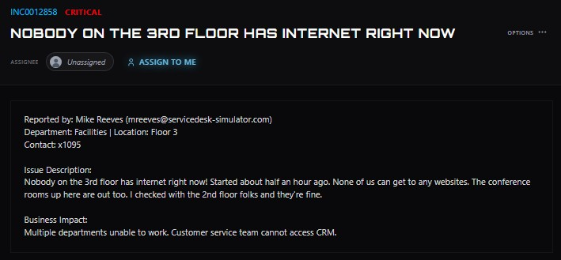
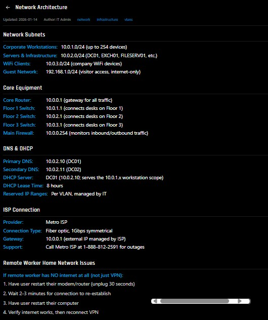
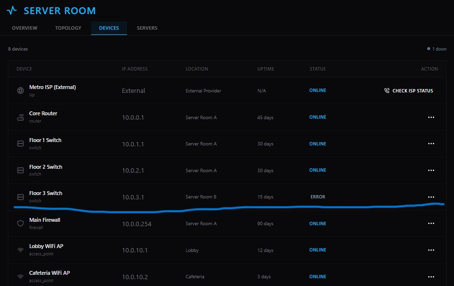
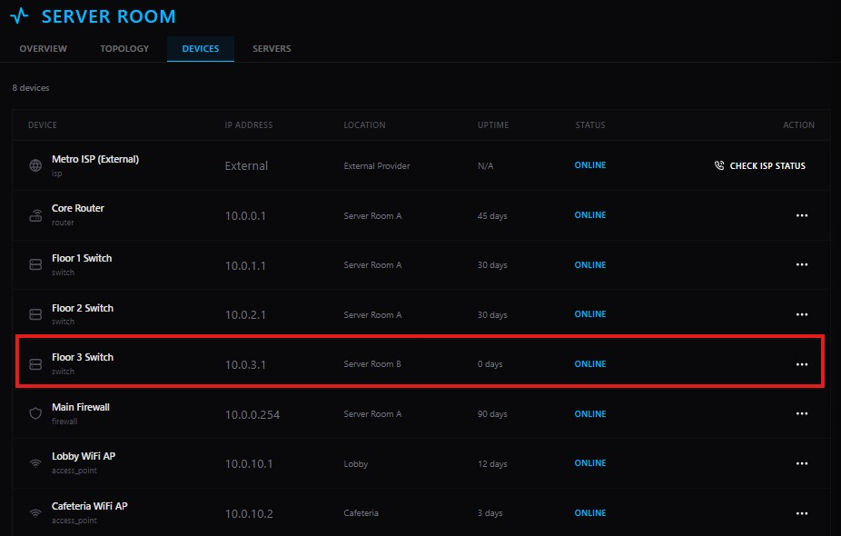
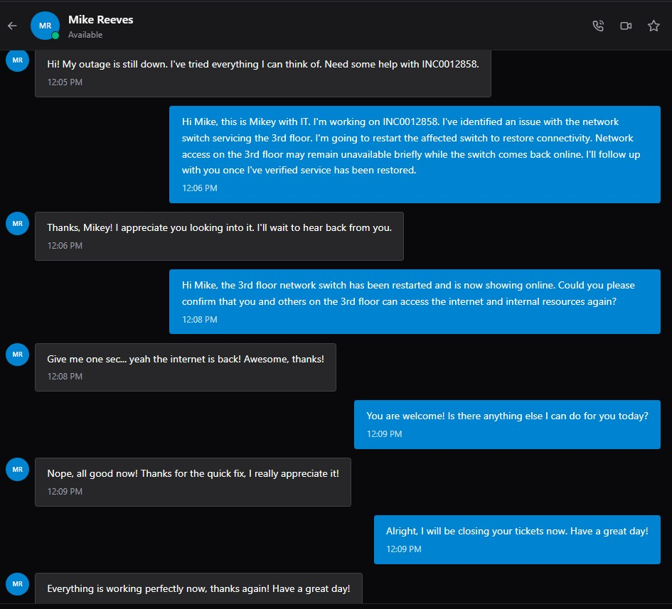

# Floor-Wide Network Outage

**Ticket:** INC0012858  
**Priority:** Critical  
**Department:** Facilities  
**Location:** Floor 3  
**Issue:** All users on the third floor lost internet and network connectivity.

## Ticket Summary

The user reported that nobody on the third floor could access the internet. The outage had started approximately 30 minutes earlier and affected multiple rooms and departments.

The incident had a critical business impact because multiple departments were unable to work and the customer service team could not access its CRM system.

## Investigation

Because the issue affected multiple users across the same floor, I treated it as a shared network infrastructure problem rather than an individual workstation issue.

I reviewed the internal **Network Architecture** documentation to identify the infrastructure responsible for connectivity on Floor 3.

The documentation identified:

- Core Router: `10.0.0.1`
- Floor 1 Switch: `10.0.1.1`
- Floor 2 Switch: `10.0.2.1`
- Floor 3 Switch: `10.0.3.1`
- Main Firewall: `10.0.0.254`

The Floor 3 switch was specifically documented as the switch connecting workstations on the affected floor.

I then checked the Server Room infrastructure status.

The ISP connection, core router, Floor 1 switch, Floor 2 switch, main firewall, and other visible network devices were online. However, the **Floor 3 Switch (`10.0.3.1`) was in an ERROR state**.

This isolated the outage to the network device shared by the affected users.

## Resolution

I informed the user that an issue had been identified with the switch servicing Floor 3 and that the device would be restarted to restore connectivity.

I restarted the Floor 3 switch and then returned to the Server Room device status to verify the result.

After the restart:

- The Floor 3 switch reported **ONLINE**.
- Its uptime reset to 0 days.
- The other network infrastructure remained online.

I then asked the user to test internet and internal network access from Floor 3.

The user confirmed that internet connectivity had returned and that everything was working normally.

## Outcome

Network connectivity was restored to Floor 3 by identifying and restarting the failed access switch. The outage was isolated without making unnecessary changes to the ISP connection, core router, firewall, or unaffected floor switches.

The user verified successful restoration of service, and no further troubleshooting or escalation was required.

## Skills Demonstrated

- Help desk incident triage
- Network outage troubleshooting
- Troubleshooting based on incident scope
- Network architecture analysis
- Network switch troubleshooting
- Infrastructure status monitoring
- Fault isolation
- Business-impact assessment
- End-user communication
- Service restoration verification
- Ticket documentation

---

> **Lab Note:** This case study was completed in ServiceDesk Simulator, a simulated IT help desk environment. It represents hands-on troubleshooting practice rather than production support performed for an employer.
