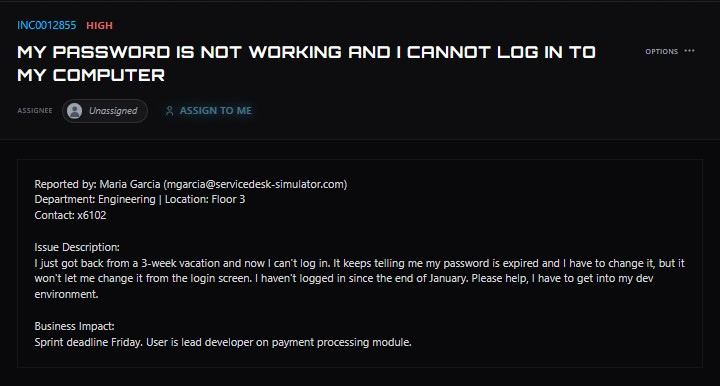
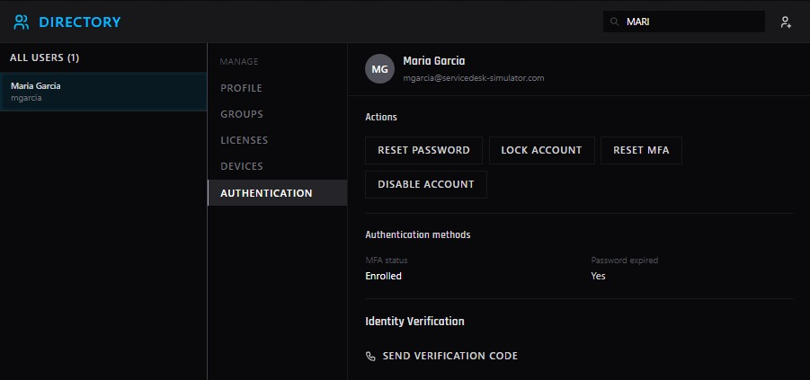
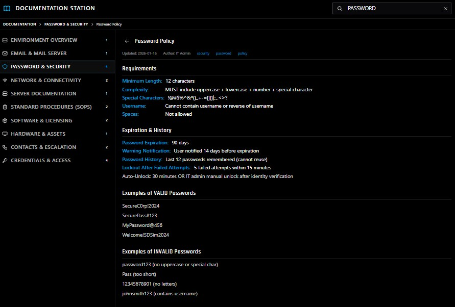
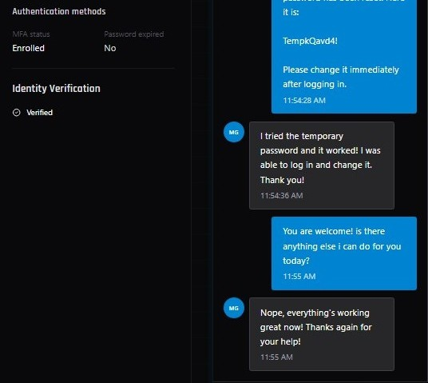

# Password Expiration and Login Failure

**Ticket:** INC0012855  
**Priority:** High  
**Department:** Engineering  
**Issue:** User unable to log in after returning from vacation because their password had expired.

## Ticket Summary

The user reported that they had returned from a three-week vacation and could no longer log in to their workstation. The login screen indicated that the password had expired and needed to be changed, but the user was unable to complete the password change.

The issue had a high business impact because the user was the lead developer working on a payment processing module with an approaching sprint deadline.

## Investigation

I reviewed the user's account in the Directory and checked the **Authentication** section. The account showed:

- MFA was enrolled.
- The password was expired.
- Identity verification was available before performing the password reset.

This confirmed that password expiration was the cause of the login failure.

Before resetting the password, I reviewed the organization's internal **Password Policy** to verify the password requirements and account recovery procedures.

The policy required passwords to:

- Be at least 12 characters long.
- Include uppercase and lowercase letters, a number, and a special character.
- Contain no spaces.
- Not contain the user's username or its reverse.
- Be changed every 90 days.
- Not reuse any of the previous 12 passwords.

The documentation also required identity verification before an administrator could manually unlock or assist with account access.

## Resolution

I sent a verification code to the user and confirmed their identity before making changes to the account.

After verification:

1. Reset the expired password.
2. Provided the user with a temporary password.
3. Instructed the user to change the temporary password immediately after logging in.
4. Confirmed the password was no longer marked as expired.
5. Asked the user to verify workstation access.

The user successfully logged in with the temporary password, changed it, and confirmed that access was fully restored.

## Outcome

The user's workstation access was restored without requiring further escalation. The user confirmed that the new password worked and that no additional issues remained.

## Skills Demonstrated

- Help desk ticket triage
- User identity verification
- Account authentication troubleshooting
- Password reset procedures
- Password policy compliance
- MFA awareness
- End-user communication
- Resolution verification
- Ticket documentation

---

> **Lab Note:** This case study was completed in ServiceDesk Simulator, a simulated IT help desk environment. It represents hands-on troubleshooting practice rather than production support performed for an employer.
