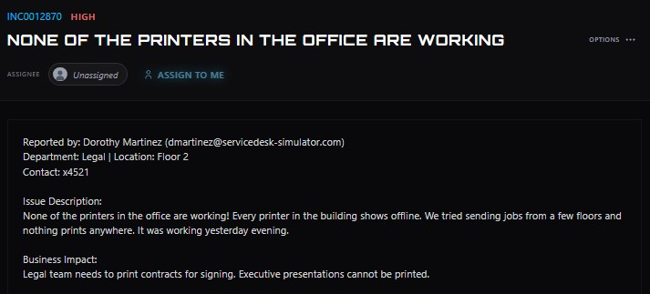
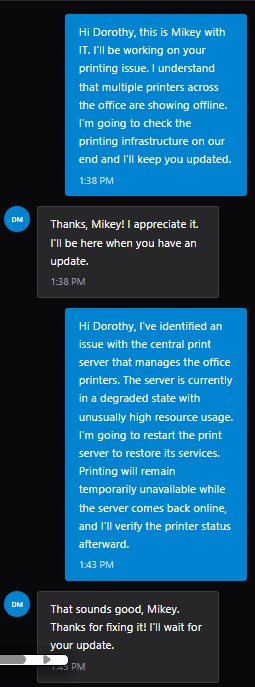
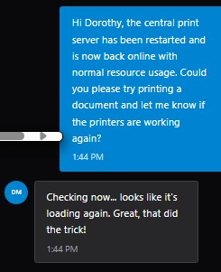

# Building-Wide Printer Outage

**Ticket:** INC0012870  
**Priority:** High  
**Department:** Legal  
**Location:** Floor 2  
**Issue:** All printers throughout the office were showing offline and users were unable to print.

## Ticket Summary

The user reported that every printer in the building was offline. Print jobs had been attempted from multiple floors without success, indicating that the issue was not isolated to a single printer or workstation.

The outage had a significant business impact because the Legal team needed to print contracts for signing and executive presentations could not be printed.

## Investigation

Because multiple printers across different floors were affected simultaneously, I investigated the shared printing infrastructure rather than troubleshooting an individual printer.

The environment used **PRINT01** as the centralized print server responsible for managing the office print queues.

I checked PRINT01 and found the server in a **DEGRADED** state with unusually high resource utilization:

- CPU utilization: **95%**
- Memory utilization: **90%**
- Server status: **DEGRADED**

This provided a common point of failure that could account for the building-wide printing problem.

## Resolution

I informed the user that I had identified an issue with the central print server and explained that the server would be restarted in an attempt to restore printing services.

I restarted **PRINT01** and then checked its status again.

After the restart:

- CPU utilization decreased from **95% to 13%**.
- Memory utilization decreased from **90% to 56%**.
- Server status changed from **DEGRADED to ONLINE**.

Although the server returning online indicated that the infrastructure had recovered, I still needed to verify the service from the user's perspective.

I asked the user to submit another print job.

The user confirmed that printing was working again.

## Outcome

Printing functionality was restored across the affected environment after restarting the degraded central print server.

The incident demonstrated the importance of considering **scope and shared dependencies** when troubleshooting. Because printers across multiple floors failed at the same time, investigating the centralized print infrastructure was more appropriate than troubleshooting individual printers independently.

No further troubleshooting or escalation was required after the user confirmed successful printing.

## Skills Demonstrated

- Help desk incident triage
- Print server troubleshooting
- Windows server support concepts
- Infrastructure monitoring
- Resource utilization analysis
- Shared-dependency identification
- Troubleshooting based on incident scope
- Service-impact communication
- End-user verification
- Ticket documentation

---

> **Lab Note:** This case study was completed in ServiceDesk Simulator, a simulated IT help desk environment. It represents hands-on troubleshooting practice rather than production support performed for an employer.
