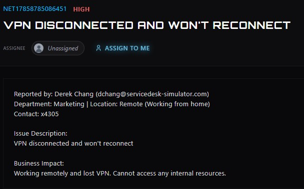
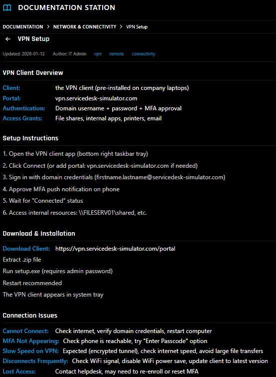
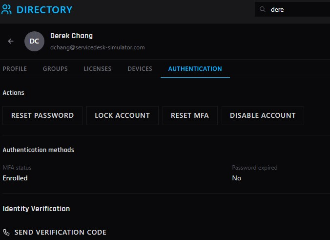
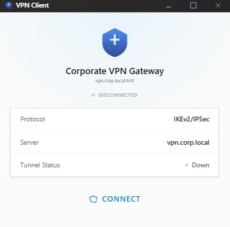
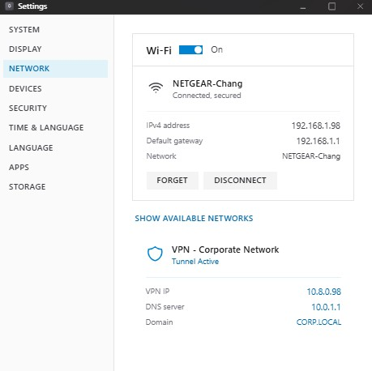
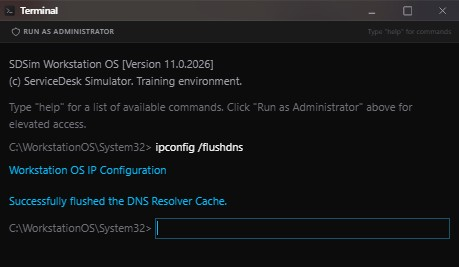
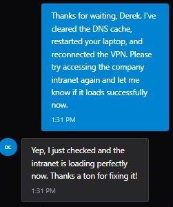

# VPN Connectivity and DNS Resolution Issue

**Ticket:** NET17858785086451  
**Priority:** High  
**Department:** Marketing  
**Location:** Remote  
**Issue:** Remote user lost VPN connectivity and could not access internal company resources.

## Ticket Summary

The user reported that their VPN had disconnected and would not reconnect while working remotely. Because the VPN provides remote access to internal company resources, the issue prevented the user from performing normal work.



## Initial Investigation

I first confirmed that the user's home internet connection was working normally and that public websites remained accessible. This helped separate the issue from a general internet outage.

I then reviewed the organization's internal **VPN Setup** documentation. The documented troubleshooting process for connection failures included:

- Verify internet connectivity.
- Verify domain credentials.
- Restart the workstation.
- Confirm MFA functionality.
- Verify access to internal resources after establishing the VPN connection.



I checked the user's authentication status in the Directory and confirmed:

- MFA was enrolled.
- The password was not expired.

The user also confirmed that their normal domain credentials worked.



## VPN Troubleshooting

The workstation was restarted and the VPN connection was tested again, but the connection initially continued to fail.

I remotely accessed the workstation for additional troubleshooting. The VPN client showed that the corporate VPN tunnel was down.



During troubleshooting, I also reset and re-enrolled the user's MFA and reinstalled the VPN client. These steps did not resolve the internal resource access issue.

The VPN tunnel was eventually able to connect. I verified that the workstation received a VPN address and showed an active corporate tunnel.

However, restoring the VPN tunnel did not completely resolve the incident. The user could access the internal file share, but the company intranet remained inaccessible.

This indicated that basic VPN connectivity was functioning while access to a hostname-based internal resource was still failing.



## DNS Resolution

After the initial troubleshooting did not fully resolve the issue, I used the ServiceDesk Simulator hint system to identify a troubleshooting step I had missed: clearing the workstation's DNS resolver cache.

I opened Terminal on the remote workstation and ran:

```powershell
ipconfig /flushdns
```

The workstation returned:

```text
Successfully flushed the DNS Resolver Cache.
```



I then restarted the workstation and reconnected the corporate VPN.

After the restart and VPN reconnection, the user tested the company intranet again and confirmed that it loaded successfully.



## Outcome

VPN and internal resource access were successfully restored. The final corrective action was clearing the workstation's DNS resolver cache, followed by a restart and VPN reconnection.

This simulation also reinforced an important troubleshooting lesson: once basic network connectivity is established but a hostname-based resource remains inaccessible, DNS resolution should be investigated before making additional authentication or infrastructure changes.

## Lessons Learned

My initial troubleshooting became broader than necessary after the basic VPN checks failed. I investigated authentication, MFA, infrastructure status, and VPN software before testing the workstation's local DNS cache.

The simulator hint helped identify this missed troubleshooting step. After applying it and verifying the result, I updated my troubleshooting approach for similar incidents:

1. Establish whether general network connectivity works.
2. Determine whether the issue affects authentication, the VPN tunnel, or access to a specific resource.
3. If IP connectivity works but hostname-based resources fail, investigate DNS resolution and cached DNS information early.
4. Make one change at a time and retest before moving to more invasive troubleshooting.

## Skills Demonstrated

- Remote help desk support
- VPN troubleshooting
- Network connectivity testing
- Authentication troubleshooting
- MFA administration
- Remote desktop support
- DNS troubleshooting
- Windows `ipconfig` utilities
- Internal resource troubleshooting
- End-user communication
- Troubleshooting documentation
- Verification of service restoration

---

> **Lab Note:** This case study was completed in ServiceDesk Simulator, a simulated IT help desk environment. The simulator's hint system was used after the initial troubleshooting did not fully resolve the incident. The identified DNS troubleshooting step was then performed and verified in the simulated workstation environment. This represents hands-on troubleshooting practice rather than production support performed for an employer.
