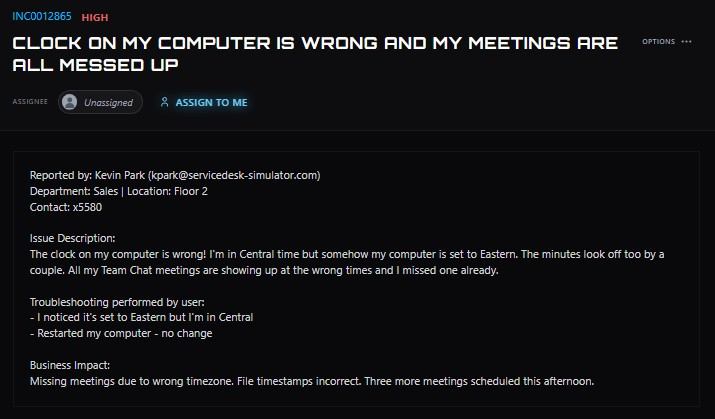
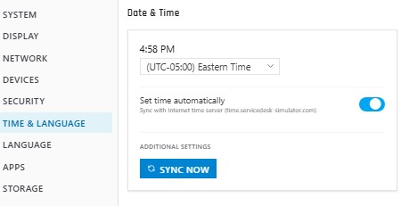
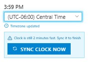

# Workstation Time Zone and Clock Synchronization

**Ticket:** INC0012865  
**Priority:** High  
**Department:** Sales  
**Location:** Floor 2  
**Issue:** Workstation configured with the wrong time zone and an inaccurate system clock, causing incorrect meeting times and file timestamps.

## Ticket Summary

The user reported that their workstation clock was incorrect. They were located in the Central Time zone, but the computer was configured for Eastern Time. The user also noticed that the minutes were off by approximately two minutes.

The issue was affecting Teams meeting times and file timestamps, and the user had already missed a meeting. Restarting the workstation had not resolved the problem.

## Investigation

I remotely connected to the user's workstation and opened the **Date & Time** settings.

The workstation was configured for:

- **Time zone:** `(UTC-05:00) Eastern Time`
- **Automatic time:** Enabled
- **Time service:** `time.servicedesk-simulator.com`

Because the user was located in the Central Time zone, the workstation's time zone configuration was incorrect.

## Time Zone Correction

I changed the workstation's time zone to:

`(UTC-06:00) Central Time`

The displayed hour changed appropriately, but the workstation then reported:

> Clock is still 2 minutes fast. Sync it to finish.

This showed that the ticket involved **two separate configuration issues**. Correcting the time zone fixed the one-hour offset, but the system clock itself still needed to be synchronized.

## Clock Synchronization

I used the workstation's **Sync Clock Now** function to synchronize the system clock with the configured company time service.

After synchronization:

- The workstation remained configured for Central Time.
- The two-minute clock discrepancy was corrected.
- The synchronization warning cleared.

## Verification

I asked the user to verify both the workstation clock and their upcoming Teams meetings.

The user confirmed that:

- The system time was correct.
- Their meeting times were displaying correctly.
- No additional issues remained.

## Outcome

The workstation's time configuration was fully corrected by changing the time zone from Eastern Time to Central Time and then synchronizing the system clock.

This ticket reinforced the importance of verifying the complete reported symptom after making a configuration change. Correcting the time zone addressed the one-hour difference, but verification revealed that the clock was still two minutes fast and required a separate synchronization step.

## Skills Demonstrated

- Remote workstation support
- Windows date and time configuration
- Time zone troubleshooting
- System clock synchronization
- Troubleshooting multiple related symptoms
- Configuration verification
- End-user communication
- Business-impact assessment
- Resolution verification
- Ticket documentation

---

> **Lab Note:** This case study was completed in ServiceDesk Simulator, a simulated IT help desk environment. It represents hands-on troubleshooting practice rather than production support performed for an employer.
